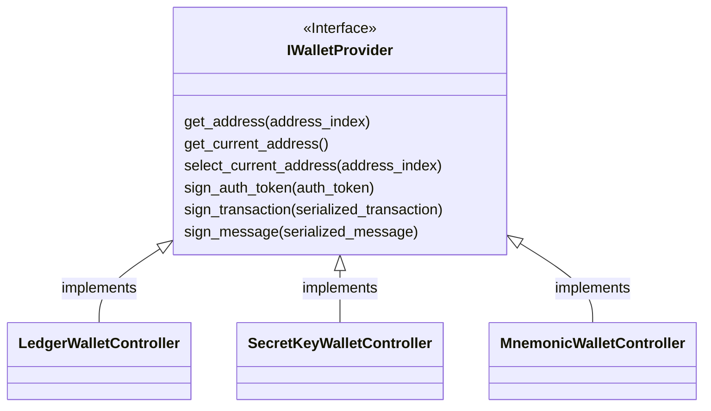

## Package `controllers`

This package holds the most high-level components of **sdk-wallet**, the ones generally used to sign transactions and messages.

## Package `crypto`

This package must be agnostic to all the other ones. Though, for languages that do no support **structural typing** (e.g. C#), the package is allowed to depend on the interfaces `ISecretKey` and `IPublicKey` (which are externally defined). In all other cases, the package must be completely self-contained and independent.

## Package `keystores`

TBD

**Implementation detail:** an instance of `EncryptedKeystoreWithMnemonic` or `EncryptedKeystoreWithSecretKey` (wrappers over the well-known JSON wallet) hold decrypted data within their state.

**Design detail:** components in `sdk-wallet/keystore` should not reference `Address` within their public interface (though they are allowed to depend on it within their implementation).

### Useful links

 - https://github.com/ethereumjs/keythereum
 - https://github.com/ethereumjs/ethereumjs-wallet/blob/v1.0.2/docs/classes/wallet.md
 - https://github.com/multiversx/mx-sdk-js-wallet/blob/v4.2.1/src/userWallet.ts
 - https://github.com/multiversx/mx-sdk-py-wallet/blob/main/multiversx_sdk_wallet/user_wallet.py
